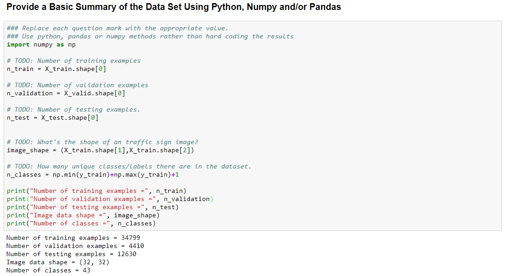
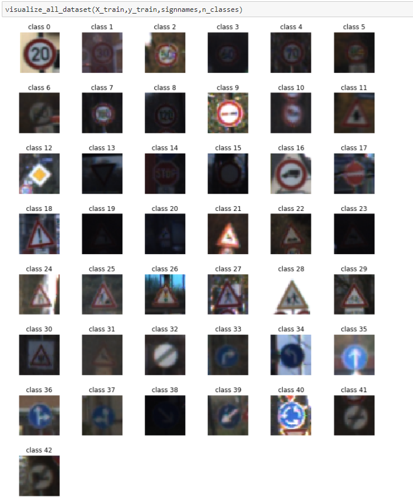

# **Traffic Sign Recognition** 

**Build a Traffic Sign Recognition Project**

The goals / steps of this project are the following:
- [x] Load the data set (see below for links to the project data set)
- [x] Explore, summarize and visualize the data set
- [x] Design, train and test a model architecture
- [x] Use the model to make predictions on new images
- [x] Analyze the softmax probabilities of the new images
- [x] Summarize the results with a written report

### Project Notebook

Here is a link to my [project code ](https://github.com/lesialin/CarND-Traffic-Sign-Classifier-Project/blob/master/Traffic_Sign_Classifier.ipynb)

You can get the whole program processes in this notebook.

### Data Set Summary & Exploration

I used the pandas library to calculate summary statistics of the traffic
signs data set:

* The size of training set is 34799

* The size of the validation set is 4410

* The size of test set is 12630

* The shape of a traffic sign image is 32x32

* The number of unique classes/labels in the data set is 43

  

#### Visualization of the dataset.

Here is an exploratory visualization of  all data set

Or,  visualize one class data, which I added traffic sign name mapped with class number

Here are the statistics of the size in each traffic sign class

### Design and Test a Model Architecture

As a first step, I decided to keep the rgb channel of the input images. I figure that the color information is useful in traffic sign recognition. So I only normalized images into zero-mean and the same standard deviation =1. The dataset mean would be zero and standard deviation would be 1 after normalization. 

I decided to generalize data to increase data set. With an appropriate data augmentation can improve the accuracy  of the training model.

To add more data to the the data set, I used the following techniques because ... 

I used histogram equalization, adding noise, affine transformation includes, shift, rotate, scale-up. 

Here is an example of an original image and an augmented image:

(note: Due to the limitation of the memory, I only add histogram equalization, noise, and scale-up augmented images into data set. But the results looked nice so far.)

#### Model Architecture 

my ginal model consisted of the following layers:

|       Layer       |               Description                |
| :---------------: | :--------------------------------------: |
|       Input       |            32x32x3 RGB image             |
|  Convolution 5x5  | 1x1 stride, valid padding, outputs 28x28x48 |
| Non-linear filter |                   RELU                   |
|    Max pooling    | 2x2 stride, valid padding, outputs 14x14x48 |
|     Drop out      |             keep prob = 0.8              |
|  Convolution 5x5  | 1x1 stride, valid padding, outputs 10x10x96 |
| Non-linear filter |                   RELU                   |
|    Max pooling    | 2x2 stride, valid padding, outputs 5x5x96 |
|     Drop out      |             keep prob = 0.8              |
|  Convolution 3x3  | 1x1 stride, valid padding, outputs 3x3x172 |
| Non-linear filter |                   RELU                   |
|    Max pooling    | 1x1 stride, valid padding, outputs 2x2x172 |
|  Fully connected  |      Input = 2x2x172. Output = 688       |
|     Drop out      |             keep prob = 0.8              |
|  Fully connected  |        Input = 688. Output = 344         |
|     Drop out      |             keep prob = 0.8              |
|  Fully connected  |        Input = 344. Output = 172         |
|     Drop out      |             keep prob = 0.8              |
|  Fully connected  |         Input = 172. Output = 86         |
|     Drop out      |             keep prob = 0.8              |
|  Fully connected  |         Input = 86. Output = 43          |
|      Softmax      |              Normalization               |

#### Parameters tuning: 

**Hyperperameters:**

- Weight initialization

  At first I used the mu = 0.0, std  = 1.0 to initialized trainable weights, which is the default set in tensorflow variable initialization.  But the accuracy after 100 epochs still super low, like 0.08 around. Then I adjust the weights initialization into mu = 0.0, std = _0.1_. And I can get the high accuracy after 5 epochs, like 0.9.

- Drop-out

  I used drop-out to regularize the training model.  This model is not too large, keep dropout prob = 0.8 would be enough.

- Batch size, epoch, learning rate.

  These set would be good with  nice result

  Batch size =128

  epoch = 80

  learning_rate = 0.001

- Display step

  display_iter = 100

  I display  every 100 iteration to observe the training progress.  

- Save model step

  save_model_step = 500

  In case some unstable issue of my computer during the training progress. I saved model in every 500 iteration. If something wrong, and training progress interrupted, I can restore the last step model  next time.

  ​

#### Training Progress

​							................................................................

My final model results were:

* training set accuracy of  99.2 %
* validation set accuracy of  96.2 %
* test set accuracy of  97.1 %

After 40 epochs, the training accuracy is close to 99.0%, which is very high. The validation accuracy is around 96% after that. And the test set accuracy is about 97%. The model is a little overfitting, which means that I can get better performance in training data but not the same as unseen data. But the accuracy in test set is pretty good. To improve the accuracy of the model require more dataset and more tunning parameters. 

### Test a Model on New Images

#### 1. Choose few German traffic signs found on the web and provide them in the report. 

Here are 16 German traffic signs that I found on the web:

Predict results:

See the label of ground truth and prediction

### Top 5 prediction

### (Optional) Visualizing the Neural Network (See Step 4 of the Ipython notebook for more details)

I visualized the activation of "Ahead Only" traffic sign. The shape is like  an arrow. The feature map of this sign is also with arrow shape and a circle outside the arrow. 

#### 

